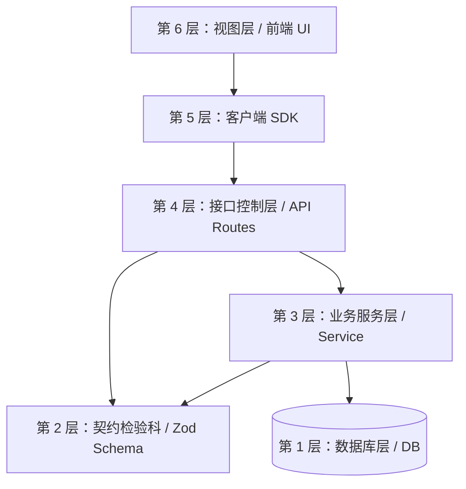

# 现代全栈项目分层架构与构建顺序指南

在开发现代健壮的商业级 Web 应用时（无论是 Node.js、Java Spring Boot 还是 Go），普遍采用**分层架构（Layered Architecture）**。这好比开一家餐厅，分工明确，互不干扰。

以下总结了一套**通用的全栈项目 6 层架构**，并且这也是**标准的从下到上（底层到表层）的开发顺序**：

---

## 项目 6 层架构流转图

---

## 🏗 各层拆解说明

### 第 1 层：数据层 (Database / Schema) —— 【农场与仓库】
- **作用**：决定数据怎么存在物理硬盘里。一切架构的地基。
- **典型文件**：`db/schema.ts`、Entity 模型定义。
- **核心动作**：
  1. 定义数据库表结构（主键、外键、字段类型）。
  2. 使用 ORM（如 Drizzle、Prisma）将结构迁移推送到真正的数据库中。

### 第 2 层：契约层 (Schema Validation / Types) —— 【食材检验科】
- **作用**：防黑客、防脏数据，统一下游拿到了什么样格式的数据。
- **典型文件**：`server/xx/schema.ts`、`type.ts`
- **核心动作**：
  1. 定义数据校验规则（如：用户名必填且必须大于 3 个字符，Zod / class-validator）。
  2. 根据校验规则，推导出标准的类型声明（Types/Interfaces），供全项目共享。

### 第 3 层：服务层 (Service) —— 【中央厨房后厨】
- **作用**：**真正的业务核心！** 所有的增删改查、金额计算逻辑都在这里。
- **典型文件**：`server/xx/service.ts`
- **核心动作**：
  1. 接收从上层传来的合法干净的数据，执行核心计算。
  2. 操作数据库，将结果抛出或者抛出业务报错（如：“余额不足”）。
- **特质所在**：Service 层是**协议无关**的。它根本不关心外部是通过 HTTP、WebSocket 还是本地终端来调用它的，它只负责加工对象。

### 第 4 层：接口/控制层 (API / Controller / Routes) —— 【大堂点餐前台】
- **作用**：对外暴露 URL 网址，接待客人的网络请求并分配任务。
- **典型文件**：`server/xx/api.ts` 或者 `routes/xxx.ts`
- **核心动作**：
  1. 注册网络路由（如 `app.post('/login')`）。
  2. 拿到用户的原始网络请求体（Request Payload）。
  3. 丢给第 2 层（契约层）检验合法性。
  4. 检验通过后，唤起第 3 层（Service 后厨）干活。
  5. 将干活的成果包装成 JSON 格式（HTTP Response）返回给调用者。

### 第 5 层：客户端 / SDK 层 (Client RPC) —— 【跑腿小哥】
- **作用**：让前端免去繁琐地拼接原生 `fetch` 以及处理跨域、Cookie 注入等恶心操作。
- **典型文件**：`hono-client.ts`、`auth-client.ts`、Swagger 生成的 Axios SDK
- **核心动作**：
  1. 封装一个无感调用的工具类/对象。
  2. 通过类似 `client.login({ ... })` 的强类型函数，连通前端和后端的第 4 层。

### 第 6 层：视图层 (UI / Page) —— 【顾客就餐区】
- **作用**：最终面向用户的视觉呈现与交互监听。
- **典型文件**：`page.tsx`、`.vue` 组件、`components/`
- **核心动作**：
  1. 绘制带有设计系统的界面与动画效果。
  2. 在按钮的 `onClick` 等事件上，直接挂载第 5 层（客户端）提供的请求操作。
  3. 获得后端返回的数据，渲染刷新视图状态（如 React 的 setState）。

---

## 🎯 万能的开发构建顺序 (Bottom-Up)

在每次进行一个**全新的业务模块**开发时（比如：做一个全新的“评论模块”），为防止满屏报错并达到最高的心流效率，**永远采用“自底向上”的构建顺序**：

1. **DB 层**：建好 `comments` 数据库表并推送。
2. **Type 层**：写好如何检验一条评论的内容（`commentSchema`）。
3. **Service 层**：编写具体的纯函数算法，实现把评论插进表里的逻辑。
4. **API 层**：暴露出 `[POST] /api/comments` 的接口路由，并绑定刚才的 Service。
5. **Client 层**：在前端导出供调用的评论请求客户端 API。
6. **UI 层**：画出绝美的评论框，加上打字动画，按钮触发提交，完成闭环！
